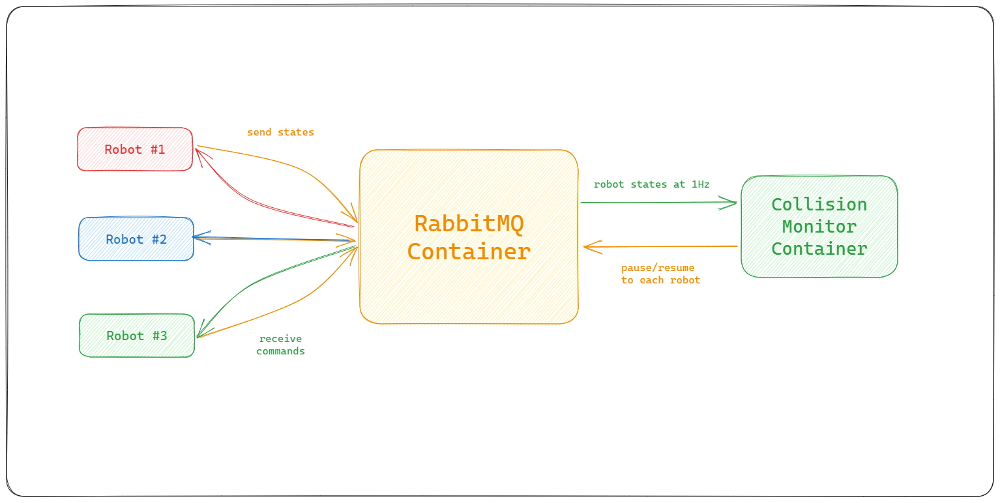
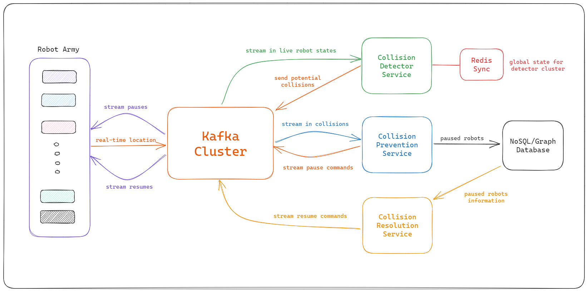

# Collision Monitor System for iw.hub

## Table of Contents
1. [Introduction](#introduction)
   1. [Project Requirements](#project-requirements)
2. [Quick Start](#quick-start)
   1. [Prerequisites](#prerequisites)
   2. [Running the Simulation](#running-the-simulation)
   3. [Viewing the Logs](#viewing-the-logs)
   4. [Stopping the Simulation](#stopping-the-simulation)
   5. [Running the Unit Tests](#running-the-unit-tests)
3. [Implementation Details](#implementation-details)
   1. [Technology Stack](#technology-stack)
   2. [Directory Structure](#directory-structure)
   3. [System Architecture](#system-architecture)
   4. [Robot Simulator](#robot-simulator)
   5. [Collision Monitor](#collision-monitor)
4. [Testing and Validation](#testing-and-validation)
   1. [Unit Tests](#unit-tests)
   2. [Validation](#validation)
5. [Scalable Production Deployments](#scalable-production-deployments)
6. [Theoretical Discussions](#theoretical-discussions)
7. [Conclusion](#conclusion)

## Introduction
The overarching aim of this project is to create a robust Collision Monitor System for `iw.hub` that proficiently manages and monitors the movement of robots to prevent collisions. The necessity for such a system arises from the complex interaction scenarios the robots face, making collision avoidance paramount to maintain the operational flow and to ensure the safety of the robots.

### Project Requirements
The foundational requirements for this project are as follows:

1. **Real-Time Monitoring:** Develop a system capable of real-time tracking and monitoring of each robot's position, orientation, and state within a defined environment.
2. **Collision Detection:** Implement algorithms capable of predicting potential collisions between the robots based on their current state and predefined paths.
3. **Command Handling:** Enable the system to send immediate commands to the robots, allowing them to pause, resume, or alter their paths to avoid collisions.
4. **State Management:** Maintain the global state of all robots efficiently, reflecting the real-time status, position, and battery level of each robot.
5. **Asynchronous Interaction:** Facilitate real-time, asynchronous interactions between robots and the monitor, ensuring immediate response to state changes or received commands.
6. **Scalability:** Design the system to be scalable, capable of managing a varying number of robots, ranging from a few to several hundred, without compromising on performance and responsiveness.
7. **Testing and Validation:** Construct comprehensive test suites to validate the functionality of each component and the system as a whole, ensuring reliability and robustness.

The ensuing report provides detailed insights into the design considerations, implementation details, testing, and validation of the developed Collision Monitor System, illustrating how it aligns with the outlined requirements to offer an effective solution for collision avoidance in `iw.hub`.
## Quick Start

### Prerequisites
- Docker installed. [Get Docker](https://docs.docker.com/get-docker/).
- Python 3.9 installed for running unit tests.

### Running the Simulation
1. Open a terminal.
2. Navigate to the project's root directory.
3. Execute: `docker-compose up`

### Viewing the Logs
- To view logs from all running containers, execute: `docker-compose logs`
- To view logs from a specific service, execute: `docker-compose logs <service_name>`

### Stopping the Simulation
1. Press Ctrl+C in the terminal where the simulation is running.
2. To remove the containers, networks, and volumes, execute: `docker-compose down`
### Running the Unit Tests
1. Navigate to the project's root directory in your terminal.
2. Execute: `python -m unittest discover tests`


## Implementation Details
### Technology Stack
- Python
- Docker
- RabbitMQ


### Directory Structure
```
Collision-Monitor/
├── collision_monitor/          # Collision Monitor Service
│   ├── __init__.py
│   ├── collision_monitor.py    # Main logic for Collision Monitor
│   └── Dockerfile
├── robot_simulator/            # Robot Simulator Service
│   ├── __init__.py
│   ├── robot.py                # Main logic for Robot Simulator
│   ├── robot_simulator.py      # Runner script for Robot Simulator
│   ├── Dockerfile
│   └── robot_states/           # Contains initial states of robots
│       ├── robot1.json
│       ├── robot2.json
│       └── robot3.json
├── rabbitmq_client/            # RabbitMQ Client Module
│   ├── __init__.py
│   └── rabbitmq_client.py      # Client logic for RabbitMQ
├── tests/                      # Unit Tests
│   ├── __init__.py
│   ├── test_collision_monitor.py
│   └── test_robot_simulator.py
├── docker-compose.yml          # docker-compose file to orchestrate the simulation
└── wait-for-it.sh              # Script to manage service dependencies in compose
```
## System Architecture
Design of the overall solution proposed, its components, and how they interact to solve the problem.

**Basic System Architecture:**



## Robot Simulator
### Design and Implementation
The robot simulator is a simple script that reads the state of a robot from a provided path and simulates the movement of the robot from the given intial state, it also sends the robot state to the RabbitMQ Queue to enable async communication with the collision monitor service.

#### Asynchronous Command Handling:
- A separate thread is used to continuously listen to and process incoming commands, allowing robots to respond to pause and resume commands in real time.

#### State Management:
- The robot's state, including its position, orientation, battery level, and the remaining path, is managed internally and can be fetched and published via RabbitMQ, facilitating real-time state sharing and interaction.

#### Path Following:
- The robot follows the initialized path, moving to the next node in the path with each move, and updating its internal state accordingly.


## Collision Monitor
### Design Considerations
The Collision Monitor is a micro-service that can be deployed as a standalone container that maintains the global state of all the robots.
This service is the core of part of our solution for collision resolution for our robots. A major chunk of implementation time went into the extendible design of this service. We want our service to be scalable to upto 1000s of robots.

#### Global State

In our current implemented simulation we are dealing with only 3 robots, we can simply maintain the global state of our robots in-memory in our collision monitor container. At a larger scale, we will need to sync the global state between each collision monitor container, there we can use redis as a distributed sync. We will discuss large scale again in a later section.

Now that we have the global state sorted out, we need to update the state of each robot upon recieving messages from the rabbitMQ queue. We can simply update the global state dictionary in this case.

#### Reactivity vs. Periodicity

Next, we need to figure out when should we run the collision detection algorithm? should we run it upon recieving each state update? or run it in a background thread at 1 Hz frequency similar to how the robots move? Let's evaluate.

- Reactive Approach (on each state update):
    - Pros:
        - Immediate response to changes in robot states.
        - Potentially more accurate as it uses the most up-to-date information.
        - Easier to implement, no need to manage python threading.
    - Cons:
        - Could be less efficient, especially if state updates are frequent and the collision detection algorithm is complex.
        - Might lead to more frequent command changes, potentially causing instability in robot movements.
- Periodic Approach (at fixed intervals):
    - Pros:
        - More efficient, especially if state updates are frequent.
        - Could lead to more stable and consistent decisions as it considers the states of all robots at the same time.
    - Cons:
        - Less reactive, potential delay in responding to changes in robot states.
        - Might miss some transient states that could be important for collision avoidance.
        - Requires implementing threading.

We opt for the **reactive approach** as we are only dealing with a small number of robots in our simulation and our collision detection can run fast enough (within 1s) to send the required commands to the robots. It is also easy to implement in a short amount of time.

At a large scale, we can opt for a periodic approach where the monitor evaluates the global states with 100s of robots using an efficient collision resolution algorithm and send out the respective pause/resume commands. This solution would be more complex to implement and would require more time.

### Detection Algorithms
We evalute 3 different solutions to detecting collisions between our robots for our simulation. Let's discuss and evaluate each approach.

#### Proximity-Based Approach
- Description: For each pair of robots, calculate the distance between their current positions and predict if they will come within a certain proximity in the next steps.
- Pros: Simple and easy to implement; does not require complex geometric calculations.
- Cons: May not be very accurate; may lead to unnecessary pauses or missed collisions.

#### Path-Based Approach
- Description: For each pair of robots, check if their future paths will intersect and if they will be at the intersection point at the same time.
- Pros: More accurate than the proximity-based approach; can detect collisions before they happen.
- Cons: Requires more complex calculations; may be less efficient for long paths.

#### Grid-Based Approach
- Description: Divide the workspace into a grid and represent the position and path of each robot on the grid. Check for collisions on the grid.
- Pros: Can be efficient and accurate; suitable for environments with many obstacles.
- Cons: Requires discretization of the workspace and paths; may be complex to implement.

Given the time constraints and wanting to reduce the complexity of our solution, we opt for the **Proximity-Based** Solution. It can be a good compromise between simplicity and accuracy for a small number of robots in a simple environment. If more accuracy is needed, we can consider refining the approach or switching to a more accurate but complex approach like path-based future collision detection.

#### Proximity Function

For each pair of robots, calculate the Euclidean distance between their current positions. This algorithm will have a runtime of O(n^2) which is fine for out 3-robot simulation.

The threshold can be the sum of the radii of the equivalent circles of the two robots, where the radius is half of the diagonal of the robot.


The diagonal \(d\) of the robot can be calculated using the Pythagorean theorem:
\[d = √(w² + l²)\]
where \(w\) is the width of the robot and \(l\) is the length of the robot.


The threshold \(T\) for collision can be calculated as:
\[T = (d₁ / 2) + (d₂ / 2)\]
where:
- \(d₁\) and \(d₂\) are the diagonals of the two robots.

As all of our robots are of the same size 6.3 x 14.3 (in Cartesian units), we can simplify our threshold to be the length of the diagonal of the robot.

```python
# Get the positions of the next nodes
x1, y1 = next_node1["x"], next_node1["y"]
x2, y2 = next_node2["x"], next_node2["y"]

# Calculate the distance between the next nodes
distance = math.sqrt((x1 - x2) ** 2 + (y1 - y2) ** 2)

# Calculate the diagonal of a robot
width, length = (
    6.3,
    14.3,
)  # Adjusted to the unit of the Cartesian plane (1 unit = 100 mm)
diagonal = math.sqrt(width**2 + length**2)

# Calculate the threshold for collision
threshold = diagonal  # Since both robots are of the same size
```

**Optimal Algorithm**

We can improve our design for larger scales by utilising spatial partionioning algorithms along with a grid-based approach that will only calculate distances for robots in the same cell that can possibly collide. We can implement this optimization using Quad-Trees. It will reduce the overhead of calculting distances between all pairs of robots.

#### Global Collision Evaluation
We use our defined proximity function to calculate collisions for all pairs of robots in their next time-step whenever we recieve a robot state update.

We want to detect collision one time-step earlier so we can send the appropriate signal and prevent the collision ahead of time, instead of finding out that a collision had happened after a particular robot moved.

**Efficient Robot Signaling**

We want to find the robot that's causing the most number of collisions and send a pause signal to it. It is in-efficient to send one pause signal for each pair of collision we detect. This approach results in the minimum number of robots that need to be stopped.

We implement a greedy algorithm that picks the robot with the maximum number of collisions each time until we have figured out all the robots we want to pause to make our global state collision free in the next time-step.

```python
# Iteratively resolve collisions globally
while collision_map:
    # Find the robot with the most potential collisions
    robot_to_pause = max(
        collision_map, key=lambda robot: len(collision_map[robot])
    )

    # Pause the robot and send the command
    self.send_command(robot_to_pause, "pause")

    # Remove all related collision pairs
    for robot in collision_map[robot_to_pause]:
        collision_map[robot].remove(robot_to_pause)
        if not collision_map[robot]:
            del collision_map[robot]
    del collision_map[robot_to_pause]
```

### Collision Resolution Algorithms
After we detect collisions and appropirately send the pause signals to the minimum number of robots needed to resolve the collision scenario, we also need to come up with an algorithm to resume old and previously paused robots.


#### Dependency Resolution:

When a robot is paused, add entries to a dependency map indicating which robots it has potential collisions with.

Whenever a robot moves, update the dependency map to remove any resolved dependencies.

After updating the dependencies, check the dependency map to find any robots that no longer have any dependencies and resume them.

- Pros:
    - Efficient: Only needs to check dependencies when a robot moves, not all possible collisions.
    - Accurate: Only resumes robots when it is safe to do so.
- Cons:
    - Complexity: Requires maintaining and updating a dependency relation, which requires using a graph DS to implement efficiently, adding complexity to the implementation.

#### Periodic Re-evaluation:

For each paused robot, check the current positions of the other robots that it had potential collisions with.

If these robots have moved to positions where they no longer pose a threat of collision, resume the paused robot.

We will need to run this periodic re-eval in a separate thread in our collision monitor.

- Pros:
    - Simple: Easy to implement, just periodically check each paused robot.
    - Robust: Can handle changes in robot paths or other unexpected events.
- Cons:
    - Inefficient: Needs to check each paused robot at regular intervals, even if no relevant changes have occurred.
    - Latency: There might be a delay in resuming robots since it’s based on periodic checks.

#### Event-Driven Re-evaluation:

Whenever a robot moves, check whether this movement resolves any potential collisions with paused robots.
Robot Pausing/Resuming:

Whenever a robot is paused or resumed, check whether this affects any paused robots.

- Pros:
    - Efficient: Only re-evaluates when a relevant event occurs.
    - Responsive: Can immediately resume robots when it becomes safe to do so.
- Cons:
    - Complexity: Requires identifying and handling all relevant events, which can be complex.
    - Latency: When running on each update, running both full collision detection and full resolution re-eval will make each iteration of the detector slow.

Given the time constraints and keeping a balance with efficient collision resolution, we opt for the **dependency resolution** algorithm. We can make it easier to implement by using hash-maps/dicts instead of implementing it with graphs.

We can combine this approach with periodic re-evaluation which will have a separate thread/service at a large scale to efficiently deal with 100s of robots.

**Deadlock Scenarios**

There is also a possiblity of reaching a deadlock state where 2 robots are in each other's dependency list and waiting for each other to resume. We will have to implement a simple deadlock resolution algorithm that will detect the cycle in the dependecy map and pick one robot to resume.

This will increase the time complexity of our algorithm (we have to cross check all keys in the dependency map with itself) but it will be easier to implement and easier to extend/update later on when we need to handle larger scales using Graphs.

```python
def resume_robots(self, moved_robot_id):
    for paused_robot, dependencies in list(self.dependencies.items()):

        dependencies.discard(
            moved_robot_id
        )  # Remove the moved robot from the dependencies of paused robots

        # using graphs can reduce the complexity of dependency resolution
        def is_in_dependency_list(robot_id):
            return any(robot_id in deps for deps in self.dependencies.values())

        # Check for potential deadlock
        if all(is_in_dependency_list(dep) for dep in dependencies):

            # Resolve deadlock by choosing one robot to resume
            robot_to_resume = self.resolve_deadlock(
                [paused_robot] + list(dependencies)
            )
            self.resume_robot(robot_to_resume)

        # If a paused robot no longer has any dependencies, resume it
        if not dependencies:
            self.resume_robot(paused_robot)
```

Combining the detection algorithm with efficient robot resumption with deadlock prevention helps our collision monitor to prevent robots from colliding with each other ahead of time and ensures smooth operation at a small scale.

## Testing and Validation
### Unit Tests
Description and results of the unit tests performed on various components of the project.

#### Robot Tests

1. **test_move_success:**
   - Tests whether the robot moves to the next node correctly and updates its state, including battery level and position, properly.

2. **test_pause_and_move:**
   - Ensures that the robot doesn’t move to the next node when it's paused.

3. **test_resume_and_move:**
   - Validates that the robot, once resumed, is able to move to the next node correctly.

4. **test_move_at_last_node:**
   - Ensures that the robot doesn't move past the last node in its path.

5. **test_handle_command_pause:**
   - Tests whether the robot correctly updates its status to `paused` when receiving a `pause` command.

6. **test_handle_command_resume:**
   - Checks if the robot correctly updates its status to `active` when receiving a `resume` command.

7. **test_handle_command_invalid:**
   - Ensures that the robot doesn’t accept an invalid status when receiving an invalid command.

#### Collision Monitor Tests

1. **test_no_collision:**
   - Tests if the collision monitor can correctly handle scenarios where there are no collisions between the robots.
   - This is verified by ensuring that no robot is paused, and all robots maintain their active state.

2. **test_all_robots_collide:**
   - Tests the scenario where all robots are on a collision course.
   - It verifies that the collision monitor correctly identifies which robot should be paused to avoid the collision and that the dependencies are properly set.

3. **test_two_robots_collide:**
   - Tests a scenario where two out of three robots are about to collide.
   - It checks if the collision monitor correctly identifies the colliding robots and sets the dependencies accurately, leaving the non-colliding robot active.

4. **test_robot_resumes_after_collision_resolution:**
   - Tests if a paused robot can correctly resume its movement after the collision has been resolved.
   - This is verified by simulating the movement of the colliding robot away from the collision point and checking whether the paused robot resumes its movement.

5. **test_robot_reaches_destination:**
   - Tests if the collision monitor properly handles the scenario where a robot has reached its destination.
   - It verifies that the robot is removed from the global state of active robots once it reaches its destination.


### Validation
We've manually tested and validated the working of our collision monitor and robot simualtor in tandem with the RabbitMQ pub/sub system.

We manually test two different scenarios end-to-end, a set of 3 robots that all collide together and end up in a deadlock and a happy case where we see no colliding robots. The system is able to detect collisions, resolve them and reach the end equilibrium state of the system. The default simulation setup in the repository represents the 3 colliding robots. We can change the files in the `robot_states` directory to try a different simulation.

Due to time constraints, we decide to stick with writing unit tests for these scenarios and we leave integrations tests to be written in the future.
Integration tests would involve all 3 components of our system, the robot simulator, collision monitoring service and our rabbitMQ instance.

## Scalable Production Deployments
Discussion about how the design can scale and considerations and modifications needed for large scale implementations. We will discuss specific steps of production-ready deployments, which cloud services to use, modify existing implementation if needed and design a scalable architecture.

### 10 Robots
At the 10 robot scale, the current implementation can manage without significant strain on resources.

#### Collision Monitor Service
Our currently implemented algorithms are robust enough to handle the scale of 10 robots. We can deploy our collision monitor with it's in-memory global state in a standalone container running on a single VM. We can host our collision monitor on any cloud provide (GCP VMs or AWS EC2).

We will however, have to add some fault tolerance in our service, upon any crashes the internal state of the collision monitor will be lost. We can fix this by dumping the robot state on a file on a persistent disk or a lightweight db after every update. Incase of any crashes, our program should read the last state from disk when it's booting up.

#### RabbitMQ Service
To prevent a single-point of failure, we can have another VM, running our rabbitMQ container, as it will only have to maintain at max 10 more queues, we don't need to worry about making our rabbitMQ service scalable just yet.

### 100 Robots
At this scale, more sophisticated strategies need to be employed to maintain system performance and reliability.

#### Collision Monitor Service
We need to make our service scalable, we can deploy our containers using managed kubernetes services like GCP GKE or AWS EKS. It'll be even easier to deploy our container's on a managed service like GCP's Cloud Run. It will handle auto-scaling, load balancing and auto-healing as well.

We need to handle the Global State for our service, we can sync it accross containers using one Redis instance, it should be good enough to hold a 100-robot large state space.

Next, we need to optimize our collision detection algorithm, we need to employ spatial partioning algorithms using Quad Trees that will divide the whole warehouse grid into smaller consumable chunks and reduce the work we need to do to calculate all collision scenarios.

As our services become more complex, we need to invest in alerting and monitoring services as well, we can utilize our cloud provider's managed services for this task. We can make our service more fault tolerant and robust in case of failures and crashes.

#### RabbitMQ Service
At this scale we need to think about improving the scalability and availability of our RabbitMQ Service. We can deploy a kubernetes cluster of RabbitMQ servers.

The cluster will consist of replicated queues making our services highly available, if one node goes down, another will be ready to serve.

Handling a large influx of robot states in a single queue might create a bottleneck, we will have to utilize RabbitMQ's sharding plugin that is able to split a single queue into multiple queues for increased throughput but it is able to maintain it has one big logical queue. We can now afford to recieve location updates from robots even at 10 times a second.

The combination of redundant RabbitMQ nodes and sharding at an individual node level can help us achieve high throughput and high availability as such a large scale.

### 1000 Robots
At the 1000 robot scale, the system needs extensive optimizations, advanced architectures, and robust fault tolerance to manage the complex interaction efficiently.

#### Collision Monitor Service
We would need to employ highly optimized and sophisticated collision detection algorithms, possibly utilizing machine learning or other AI techniques, to handle the increased complexity and interaction efficiently.

We would need to use advanced state management solutions like distributed databases with high read and write speeds to maintain and synchronize the global state of robots effectively and consistently.

We might want to split our service into smaller micro-services that deal with one part of the problem each. The distributed db will help us sync accross our micro-services.
- We can have the collision detection service run spatial partioning or machine learning algorithms independently and scale to it's individually required resources (e.g GPUs for ML).
- Similarly, the collision prevention service can run it's own algorithms on the detected potential collisions and send out the pause commands optimally.
- Lastly, we can run a separate collision resolution service that runs it's decision-making algorithms to decide which robot to unpause and resolve deadlock scenarios.

#### RabbitMQ Service
Our rabbitMQ scalable cluster with queue sharding should be able to handle a scale of 1000s of messages per second. It can handle increased frequency of location updates as well. We can probably handle 2-3 location updates per second for 1000 robots.

We can choose move our RabbitMQ cluster from kubernetes to one of the managed RabbitMQ solutions provided by cloud providers like AWS. This will reduce the overhead for us to maintain the cluster ourself and also support monitoring and alerting on it.

### Large-Scale System Design
Let's discuss on how we can take our design to the next level, we're talking about monitoring more than 1000 robots that send their state updates more frequently for improved accuracy. If robots move quite fast we need to send location updates 10 times or even 100 times in one second.
This would scale up the messages we have to process every second to upto 100K.

RabbitMQ would not be able to handle such throughput as it can handle around 3-4k messages per second. We would have to look at alternatives like Kafka at this scale, it is able scale-up to stream messages in real-time with upto 1000k messages per second.

**Scalable System Architecture:**




## Theoretical Discussions
### Delays in State Messages
- Message Retries and Acknowledgements: Design a robust messaging protocol where messages that could not be delivered due to connectivity issues are retried. Implement acknowledgements to ensure that messages have been received and processed.

- Time Stamps: Each message has timestamp indicating when the state was recorded, allowing the Collision Monitor to account for delays and adjust calculations accordingly.

- Buffering and Caching: Implement buffering mechanisms on the robots, allowing them to store state messages locally when the network is unavailable and send them once the connection is restored.


- Notification and Alerts: Implement alerting mechanisms to notify operators about the delay in state messages so that manual interventions can be made if necessary.
### Handling Dead-Zones
- Global Backup-plan: Whenever a robot enters the network, give it a backup global plan that is created on runtime to avoid collision according to the path plans given to all the robots at that time, when it looses connectivity it can reply on the offline backup plan.

- Use of Sensors: Employ additional sensors on robots, like lidar or ultrasonic sensors, allowing them to detect and avoid collisions autonomously using machine learning algorithms that run on-device, in areas with no connectivity.

- Swarm Intelligence: Implement swarm intelligence algorithms to allow robots to coordinate and make decisions collectively, reducing the reliance on a central collision monitor and allowing more adaptive and resilient behavior, especially in dead-zones.

### Limitations of Collision Monitor
- Real-Time Constraints: The Collision Monitor might struggle in scenarios where real-time decisions are required, and even slight delays in processing or communication can lead to collisions. We should probably change our approach to predictive collision prevention.

- Dynamic Environments: In complex environments where obstacles or even moving humans are present, we cannot simply reply on our service anymore as it cannot control other moving obstacles or humans.

- Robot Dependant: In scenarios where robot sensors are not as accurate and might return incorrect information, our collision detector will fail more often, e.g. dusty or foggy environments.

### Proactive Approaches for Collision Avoidance
- Global Path Planning: Implement advanced path planning algorithms that consider the paths of all robots in a global context to avoid potential collisions and deadlocks proactively, rather than reacting to possible collisions.

- Dynamic Replanning: Equip robots with the capability to dynamically replan their paths based on the real-time states of their surroundings, allowing them to avoid unexpected obstacles or changes in the environment.

- Swarm Intelligence: Implement swarm intelligence algorithms to allow robots to coordinate and make decisions collectively, reducing the reliance on a central collision monitor and allowing more adaptive and resilient behavior, especially in dead-zones.
## Conclusion

In conclusion, this project was successful in developing a functioning Collision Monitor System for iw.hub robots, addressing the necessity of real-time collision detection and avoidance within a factory setting. The system is robust, practical, and scalable, capable of integrating seamlessly in varied operational environments.

This endeavor allowed for a deeper understanding of real-world applications and potential challenges, such as connectivity issues and operational dead-zones, and presented opportunities for practical problem-solving and application of theoretical knowledge.


